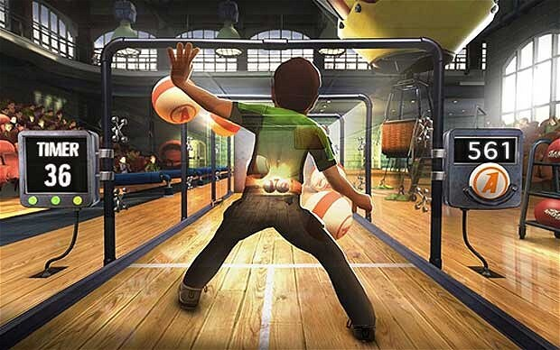
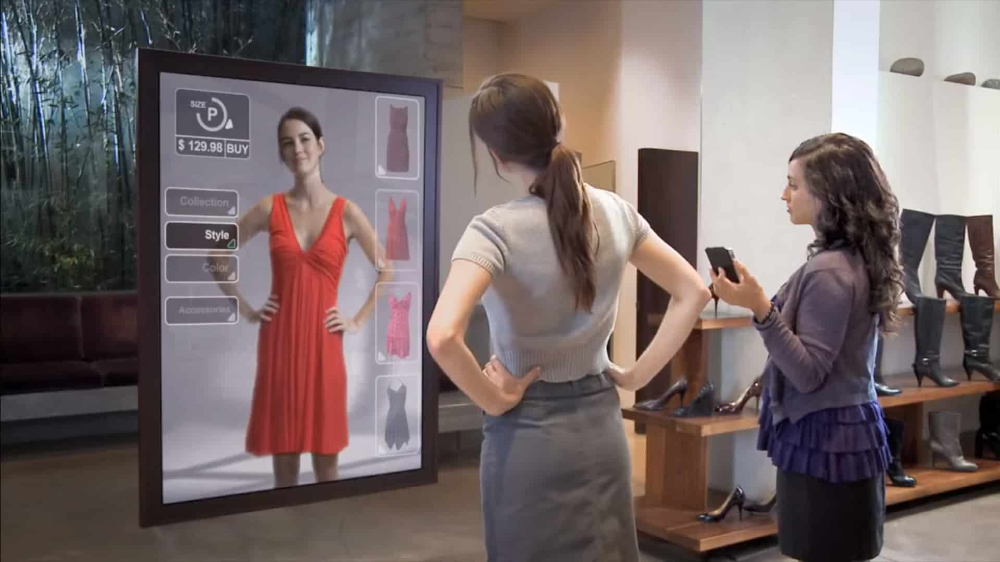
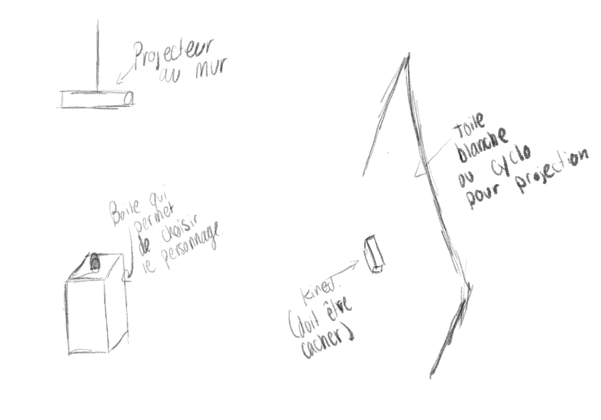
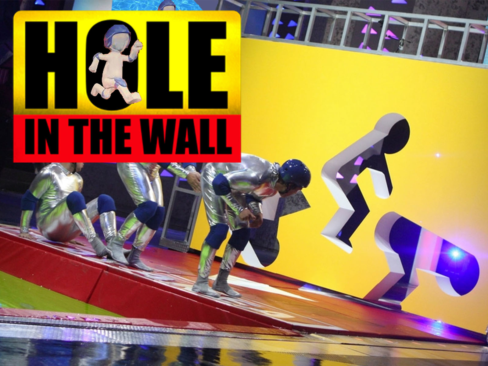

# La motion capture

## Qu'est-ce que c'est que la motion capture ?
>
La motion capture ou la capture de mouvement est une technique d'enregistrement permettant de connaître la position et la rotation d'un objet ou d'une personne pour ensuite transmettre le résultat dans un logiociel de montage 3d. Grâce a ça, les monteurs peuvent créer un squelette qui peut être intégrrer à une perosnnage, d'un jeu ou autre, déjà créer pour le faire bouger. La technologie est basé sur la kinect pour permettre a l'acteur de créer directement un squellette dans l'application de montage 3D.

   ## Quelle sont les usagés de ce type d'enregistrement ?
   Les industries qui utilisent le plus ce type d'enregidtrement, c'est le monde du cinema et celui des jeux vidéos. Ce sont les princiaples industries qui utilisent cette technique, mais pas les seules. C'est aussi un outil de recherche pour la santé et le sport. Cette technologie est utilisé pour visualiser et diagnostiquer avec précision les mouvements corporels et les problèmes de santé.
>
   ### Exemples de projet cinématographique utilisant cette technique. 
>
La liste est quand même très longue et je ne pourrais siter tout les films qui ont utilisés cette technique d'enregistrement. 
>
Dans les films qui ont été intégrlament tournés en motion capture il y a :
   >
- le pôle express (2004)
- Les Aventures de tintin : le secret de la licorne (2011)
- Monster House (2006)
- Milo Sur Mars (2011)
- La Planète Des Singes : l'Affrontement (2014)
>
et plus encore ...
>

>
### Jeux vidéos
>
Pour ce qui est des jeux vidéos la liste est encore plus longue, mais pour donner quelques exemples; les jeux de sports comme Madden, NHL ou Fifa, sont tous des jeux qui utilisent la motion capture pour donner du réalisme aux mouvements de chaques joueurs.
>

## Pourquoi utiliser ce type d'enregistrement plustôt que directement l'animer ?
Alors la principal raison pourquoi la motion capture est utilié, c'est parce qu'elle permet de donner un maximum de réalisme aux personnages présent dans la vidéo. Aussi ça permet de perdre moins de temps a animer pièces par mpièces chaques personnages, car le squellete créé peut être attribué a plusieurs personnages du jeux. Sauf qu'il n'y aura pas de différence entre chacun du au même squellete animé.

## Dans quoi d'autre que la motion capture peut être utilisé

Pour ce qui est du contexte étudiant que je suis, je pourrais dire que la morion cpature pourrait être utiliser pour un projet interactif avec un ou plusieurs utilisateurs qui devront bouger pour que la scène soit activé. Comme un jeu vidéo, les utiliasateurs auront des objectifs a atteindre pour complèter l'interaction. La kinect serait le materiel numéro un à utiliser, car son système permet de créer un squellete infomratique dès qu'une personne est détecté.

Sinon, la kinect pourrait aussi être utilisé comme trigger. Dès qu'une personne entre dans le périmètre de la caméra de la kinect une vidéo ou dequoi du genre s'active. Dans ce cas la scène n'a pas d'interaaction avec les utilisateurs, mais est utilisé juste pour detecter un utilisateur. 

# Idée de projet
Mon idée serait de créer une sorte de jeu pour enfant, le but serait de générer du plaisir au jeunes en incarant leurs personnages favoris. Le focntionnement serait de avec une kinect, générer un squellette 3D du jeune qui sera devant la camera et il pourra ensuite choisir un personnage de la base de données pour le voir sur l'image et quand il bougera le personnage va bouger en même en reproduisant les mouvements du jeune.

Un peu comme un miroir, la personne regardera son reflet mais sous forme d'un perosnnage 3D choisi dans les modèles offert pour l'interaction. l'utilisateur pourra bouger comme il le veut pour un temps indéterminé. 

## Matériel
- kinect
- écran
- ou projecteur
- si jutilise un projecteur je vais avoir de besoin d'une toie blanche pour la projection
- un ordinateur
- haut parleur

## idée de l'espace d'utilisation
  si j'utilise un projecteur je pourrais utiliser le cyclo du grand studio pour permettre une meilleur intégration et je pense que les utilisateurs vont avoir une meilleure immersion.

  Sinon je pense que le grand studio va etre le meilleur endroit pou faire ce projet, car c'est la place je pense qui a le plus d'esapce pour bouger. Dehors pourrait être une option, mais vu que nous allons déployer pendant l'hiver le froid pourrait être un trop grand enjeu.

## procédure
- L'utilisateur devra d'abord se mettre devant la kinect pour être détecter (une écran titre sera deja en cour pour attirer l'oeil)
- une fois l'enfant detecter, une musique se déclenchera
- au moment de la detection, un squellete 3d se crée automatiquement
- ensuite lenfant aura une interface qui pourra choisir le personnage qu'il voudra interprêter
- le jeu pourra commencer, le personnage 3D choisi bougera comme l'enfant

### le but de cette installation
le but c'est bien sur de mettre un sourire aux lèvres des enfants,  mais aussi de pouvoir apporter la technologie 3d accessible à tous même les plus jeunes.

## Disposition des matériaux

## idée de plus
Sinon pour que mon projet cible plus de perosnnes je pourrais d'une façon, encore inconnu, que l'utilisateur crée son propre perosnange un peu comme la facon de bitmoji ou de personnages xbox.  

## Défis
- le temps
- faire fonctionner les logiciels encore inconnu
- devoir faire et respecter un budget $
- que tout les logiciels fonctionnent bien tout ensemble même si je ne suis pas présent.
- faire en sorte que le projet soit bien mit de l'avant pour que les utilisateurs veulent l'essayer.

# Idée de projet - Ça passe ou ça casse

## description du projet
L'idée ici est de créer un jeu inspiré de l'émission ça passe ou ça casse. DOnc le participant devra se tenir debout devant une camera (kinect), et un module apparaîtra avec une forme spécial. le but c'est de passer dans le trou blanc du module.

## Matériel
- kinect
- écran
- ou projecteur
- si jutilise un projecteur je vais avoir de besoin d'une toie blanche pour la projection, ou mur completement blanc.
- un ordinateur
- haut parleur

- ## Défis
- le temps
- faire fonctionner les logiciels encore inconnu
- que tout les logiciels fonctionnent bien tout ensemble même si je ne suis pas présent.
- faire en sorte que le projet soit bien mit de l'avant pour que les utilisateurs veulent l'essayer.

# Prototype
Mon projet était de faire une sirte de jeux interactif comme le jeu télévisé ça passe ou ça casse.

## Quelle partie du projet
Je m'occupe surtout de la gestion des périfériques. Mon prototype consiste à bine installé la kinect et aller chercher les bonnes valeurs. 

## Test
Ce que j'ai voulu tester c'est de voir jusqu'ou je pouvais aller avec la kinect de la xbox one. La distance que je peux atteindre, la detection des mouvements et l'arrière plan.

## Comment
J'ai connecté une kinect xbox one au logiciel Kinect Studio V2.0, ensuite j'ai pus mettre l'image de la kinect sur touchdesigner pour pouvoir aller récupérer les données de chaque membres du corps.

## Résultat
J'ai constaté qu'il y a avait beaucoup de valeurs générer par un corps et un mouvement. Par contrre je n,mai pas encore trouvé la limite exact de l'arrière-plan de la kinect pour savoir si je dois avoir un fond déja générer que ce soit en virtuelle ou un mur dans le réel.

## Conclusion
La kinect est belle et bien la bonne technologie a utilisé pour mon projet masi reste a déterminer la question de l'arrière-plan à l'emplacement où je vais avoir l'installation final. 
